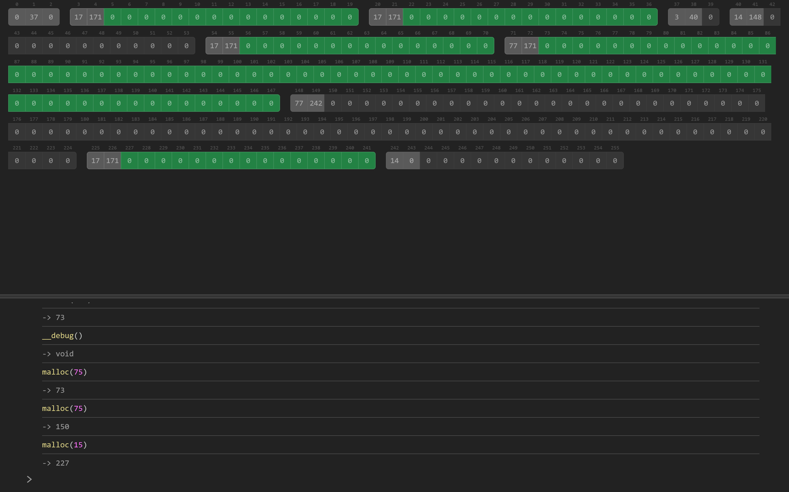

# Malloc



A visualizer to help explain `malloc()` and related concepts.

A live version can be found [here](https://josh-audio.github.io/malloc).

## Usage

The interface displays a 256-byte array of memory cells. The first three are reserved, and have the following uses:
- 0x00 is `nullptr`, and so is unused
- 0x01 is a pointer to the first item in the free list
- 0x02 is a pointer to the next free item, if the `NEXT_FIT` allocation strategy is being used.

Memory cells can be edited by clicking and typing.

Hovering over reserved cells may show hints based on their meaning:
- Hovering a reserved cell that is a pointer to another cell will highlight the destination cell.
- Hovering a reserved cell that represents a block size will highlight the block.

Below the memory visualizer is a command interpreter. This interpreter allows a limited set of C-style statements.

Expressions will output their result. For example:

```c
5;
// -> 5

2 + 3;
// -> 5;
```

The interpreter supports variable declaration and assignment:

```c
int value = 5;
int otherValue = value + 10; // -> 15
```

Memory can be referenced and modified using pointers:

```c
char *a = 0xA; // pointer to memory address 0xA
char *b = a + 1; // pointer to memory address 0xB
*a = 5;
*b = 10;
*a + *b; // -> 15
```

Finally memory can be allocated and freed using `malloc()` and `free()`:

```c
int *a = malloc(sizeof(int));
*a = 0xFFFF1234;
free(a);

double *b = malloc(sizeof(double) * 2);
b[0] = 1.2;
b[1] = 2.3;
free(b);
```

## Interpreter Helpers

Besides `malloc()`, `free()` and `sizeof()`, there are a few helper functions that can be used from within the interpreter:
- `reset()`: Resets the memory to its original state
- `clear()`: Clears the command history
- `setDisplayBase(base)`: Sets the display base for the memory visualization; accepts either `10` or `16`. Default is `10`.
- `setStrategy(strategy)`: Sets the memory allocation strategy. Accepts `FIRST_FIT`, `NEXT_FIT`, `WORST_FIT` or `BEST_FIT`.

## Development

To develop:

1. Clone the repo
2. Run `npm install`
3. Run `npm run dev`

To rebuild the nearley grammar:

1. Run `npm install -g nearley`
2. In the repository root, run `node --experimental-strip-types compile-grammar.ts`
